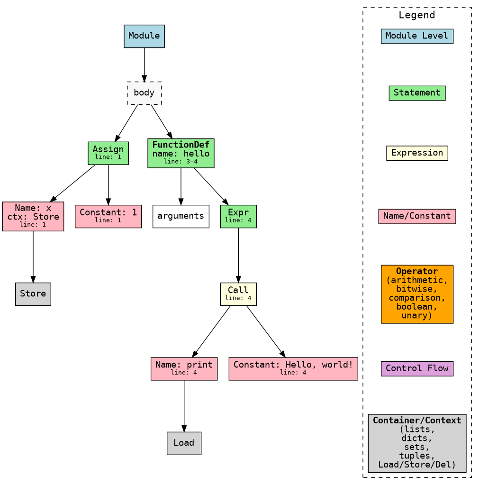
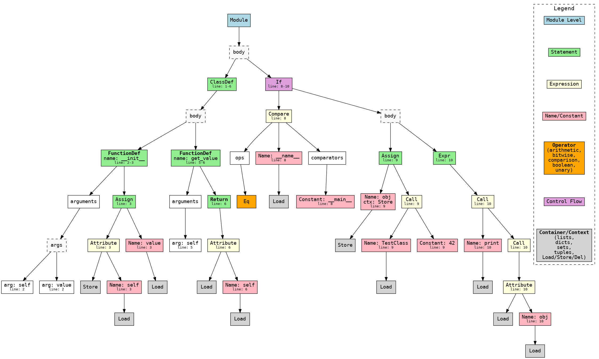
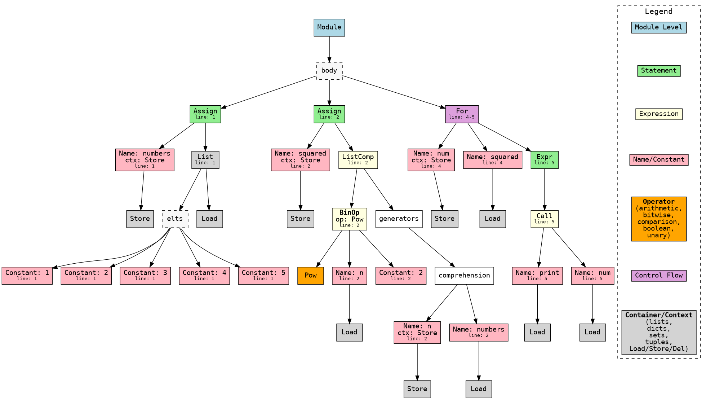

# Python AST Visualizer

A tool to visualize Python's Abstract Syntax Tree (AST) using Graphviz.

## Python AST Structure

The AST follows Python's abstract grammar, which defines the following main components:

```text
module Python
{
    mod = Module(stmt* body, type_ignore* type_ignores)
        | Interactive(stmt* body)
        | Expression(expr body)
        | FunctionType(expr* argtypes, expr returns)

    stmt = FunctionDef(identifier name, arguments args,
                       stmt* body, expr* decorator_list, expr? returns,
                       string? type_comment, type_param* type_params)
          | AsyncFunctionDef(identifier name, arguments args,
                             stmt* body, expr* decorator_list, expr? returns,
                             string? type_comment, type_param* type_params)
          | ClassDef(identifier name,
             expr* bases,
             keyword* keywords,
             stmt* body,
             expr* decorator_list,
             type_param* type_params)
          | Return(expr? value)
          | Delete(expr* targets)
          | Assign(expr* targets, expr value, string? type_comment)
          | TypeAlias(expr name, type_param* type_params, expr value)
          | AugAssign(expr target, operator op, expr value)
          | AnnAssign(expr target, expr annotation, expr? value, int simple)
          | For(expr target, expr iter, stmt* body, stmt* orelse, string? type_comment)
          | AsyncFor(expr target, expr iter, stmt* body, stmt* orelse, string? type_comment)
          | While(expr test, stmt* body, stmt* orelse)
          | If(expr test, stmt* body, stmt* orelse)
          | With(withitem* items, stmt* body, string? type_comment)
          | AsyncWith(withitem* items, stmt* body, string? type_comment)
          | Match(expr subject, match_case* cases)
          | Raise(expr? exc, expr? cause)
          | Try(stmt* body, excepthandler* handlers, stmt* orelse, stmt* finalbody)
          | TryStar(stmt* body, excepthandler* handlers, stmt* orelse, stmt* finalbody)
          | Assert(expr test, expr? msg)
          | Import(alias* names)
          | ImportFrom(identifier? module, alias* names, int? level)
          | Global(identifier* names)
          | Nonlocal(identifier* names)
          | Expr(expr value)
          | Pass | Break | Continue
          attributes (int lineno, int col_offset, int? end_lineno, int? end_col_offset)

    expr = BoolOp(boolop op, expr* values)
         | NamedExpr(expr target, expr value)
         | BinOp(expr left, operator op, expr right)
         | UnaryOp(unaryop op, expr operand)
         | Lambda(arguments args, expr body)
         | IfExp(expr test, expr body, expr orelse)
         | Dict(expr* keys, expr* values)
         | Set(expr* elts)
         | ListComp(expr elt, comprehension* generators)
         | SetComp(expr elt, comprehension* generators)
         | DictComp(expr key, expr value, comprehension* generators)
         | GeneratorExp(expr elt, comprehension* generators)
         | Await(expr value)
         | Yield(expr? value)
         | YieldFrom(expr value)
         | Compare(expr left, cmpop* ops, expr* comparators)
         | Call(expr func, expr* args, keyword* keywords)
         | FormattedValue(expr value, int conversion, expr? format_spec)
         | JoinedStr(expr* values)
         | Constant(constant value, string? kind)
         | Attribute(expr value, identifier attr, expr_context ctx)
         | Subscript(expr value, expr slice, expr_context ctx)
         | Starred(expr value, expr_context ctx)
         | Name(identifier id, expr_context ctx)
         | List(expr* elts, expr_context ctx)
         | Tuple(expr* elts, expr_context ctx)
         | Slice(expr? lower, expr? upper, expr? step)
         attributes (int lineno, int col_offset, int? end_lineno, int? end_col_offset)

    expr_context = Load | Store | Del
    boolop = And | Or
    operator = Add | Sub | Mult | MatMult | Div | Mod | Pow | LShift | RShift | BitOr | BitXor | BitAnd | FloorDiv
    unaryop = Invert | Not | UAdd | USub
    cmpop = Eq | NotEq | Lt | LtE | Gt | GtE | Is | IsNot | In | NotIn
    comprehension = (expr target, expr iter, expr* ifs, int is_async)
    excepthandler = ExceptHandler(expr? type, identifier? name, stmt* body)
                    attributes (int lineno, int col_offset, int? end_lineno, int? end_col_offset)
    arguments = (arg* posonlyargs, arg* args, arg? vararg, arg* kwonlyargs,
                 expr* kw_defaults, arg? kwarg, expr* defaults)
    arg = (identifier arg, expr? annotation, string? type_comment)
           attributes (int lineno, int col_offset, int? end_lineno, int? end_col_offset)
    keyword = (identifier? arg, expr value)
               attributes (int lineno, int col_offset, int? end_lineno, int? end_col_offset)
    alias = (identifier name, identifier? asname)
             attributes (int lineno, int col_offset, int? end_lineno, int? end_col_offset)
    withitem = (expr context_expr, expr? optional_vars)
    match_case = (pattern pattern, expr? guard, stmt* body)
    pattern = MatchValue(expr value)
            | MatchSingleton(constant value)
            | MatchSequence(pattern* patterns)
            | MatchMapping(expr* keys, pattern* patterns, identifier? rest)
            | MatchClass(expr cls, pattern* patterns, identifier* kwd_attrs, pattern* kwd_patterns)
            | MatchStar(identifier? name)
            | MatchAs(pattern? pattern, identifier? name)
            | MatchOr(pattern* patterns)
             attributes (int lineno, int col_offset, int end_lineno, int end_col_offset)
    type_ignore = TypeIgnore(int lineno, string tag)
    type_param = TypeVar(identifier name, expr? bound, expr? default_value)
               | ParamSpec(identifier name, expr? default_value)
               | TypeVarTuple(identifier name, expr? default_value)
               attributes (int lineno, int col_offset, int end_lineno, int end_col_offset)
}
```

## Node Colors

The visualization uses the following color scheme:

- **Module Level** (`lightblue`)
- **Statements** (`lightgreen`)
- **Expressions** (`lightyellow`)
- **Names and Constants** (`lightpink`)
- **Operators** (`orange`)
- **Control Flow** (`plum`)
- **Containers** (`lightgrey`)

## Technical Implementation Details

### Color Mapping

The color scheme for AST node types is defined in the `NODE_COLORS` dictionary in `ast_parser.py`. This dictionary maps each AST node type (as a string) to a color name. For example:

```python
NODE_COLORS = {
    # Module Level
    'Module': 'lightblue',
    # Statements
    'FunctionDef': 'lightgreen',
    # ...
    # Operators (arithmetic, bitwise, comparison, boolean, unary)
    'Add': 'orange', 'Sub': 'orange', 'Eq': 'orange', 'And': 'orange', 'Not': 'orange',
    # Contexts
    'Load': 'lightgrey', 'Store': 'lightgrey', 'Del': 'lightgrey',
    # ...
}
```

All operator types (arithmetic, bitwise, comparison, boolean, unary) are colored orange. Context nodes (`Load`, `Store`, `Del`) are colored light grey, the same as containers.

### Legend Generation

The legend in the output graph is generated from a list of representative node types and their categories:

```python
LEGEND = [
    ("Module Level", 'Module'),
    ("Statement", 'FunctionDef'),
    ("Expression", 'BinOp'),
    ("Name/Constant", 'Name'),
    ("Operator (arithmetic, bitwise, comparison, boolean, unary)", 'Add'),
    ("Control Flow", 'If'),
    ("Container/Context (lists, dicts, sets, tuples, Load/Store/Del)", 'List'),
]
```

In the `generate_dot` function, the legend is rendered as a subgraph with colored boxes and labels, matching the color map. The legend is positioned at the top right of the output graph.

### AST Parsing and Visualization

- The input Python code is parsed using the `ast` module to produce an AST.
- The AST is recursively converted to a dictionary structure, preserving important fields (such as `name`, `id`, `arg`, and line numbers).
- The `generate_dot` function traverses this dictionary, creating a Graphviz node for each AST node. The node's color is determined by its type using `NODE_COLORS`.
- Labels are formatted with the node type, relevant fields, and line numbers (in small font).
- Container nodes (like `body`, `args`, etc.) are shown as dashed boxes only when they have multiple children. Single-child containers are skipped for clarity.
- Context nodes (`Load`, `Store`, `Del`) are rendered as light grey, the same as containers, to indicate their auxiliary role in the AST.
- All operator types (arithmetic, bitwise, comparison, boolean, unary, and comparison) are rendered in orange for easy identification.

**Note:** The AST traversal in `generate_dot` is recursive. For extremely deep or adversarially nested ASTs, this could hit Python's recursion limit (typically 1000). For most real-world code, this is not an issue. If you need to handle very deep trees, consider adding a `max_depth` safeguard or rewriting the traversal to use an explicit stack (iterative approach).

### Example: Rendering a Node

For example, a comparison operation like `x < 0` will be rendered as:
- A `Compare` node (light yellow, as an expression)
- With child nodes for the left operand (`Name: x`), the operator (`Lt`, orange), and the right operand (`Constant: 0`)

```python
# Example snippet from generate_dot:
color = NODE_COLORS.get(node['type'], 'white')
dot.node(node_id, label=label, style=style, fillcolor=color, shape='box')
```

This approach ensures that every node type defined in the Python AST grammar is colored and labeled according to its role, making the visualization both accurate and easy to interpret.

## Usage

```bash
python cli.py your_file.py -o output
```

This will generate an SVG or PNG file named `output.svg` or `output.png` containing the AST visualization.

For example:
```bash
python cli.py test_0.py -o ast_0
```

## Project Structure

- `cli.py` — Command-line entry point for the tool
- `ast_parser.py` — API for parsing Python code to AST
- `ast_handlers.py` — AST node handler logic
- `dot_render.py` — Graphviz rendering logic
- `viz_config.py` — Color and legend configuration

## Example

For the following Python code:
```python
def greet(name):
    message = "Hello " + name
    return message
```

The visualization will show:
- Function definition node (lightgreen)
- Name nodes (lightpink)
- String constant (lightpink)
- Binary operation (lightyellow)
- Return statement (lightgreen)

## Test Files and Outputs

Below are the test files used for visualization and their corresponding output files:

### test_0.py
```python
x = 1

def hello():
    print("Hello, world!")
```
**Output:** `tests/ast_0.png`


### test_1.py
```python
class TestClass:
    def __init__(self, value):
        self.value = value

    def get_value(self):
        return self.value

if __name__ == "__main__":
    obj = TestClass(42)
    print(obj.get_value())
```
**Output:** `tests/ast_1.png`


### test_2.py
```python
numbers = [1, 2, 3, 4, 5]
squared = [n ** 2 for n in numbers]

for num in squared:
    print(num)
```
**Output:** `tests/ast_2.png`
 