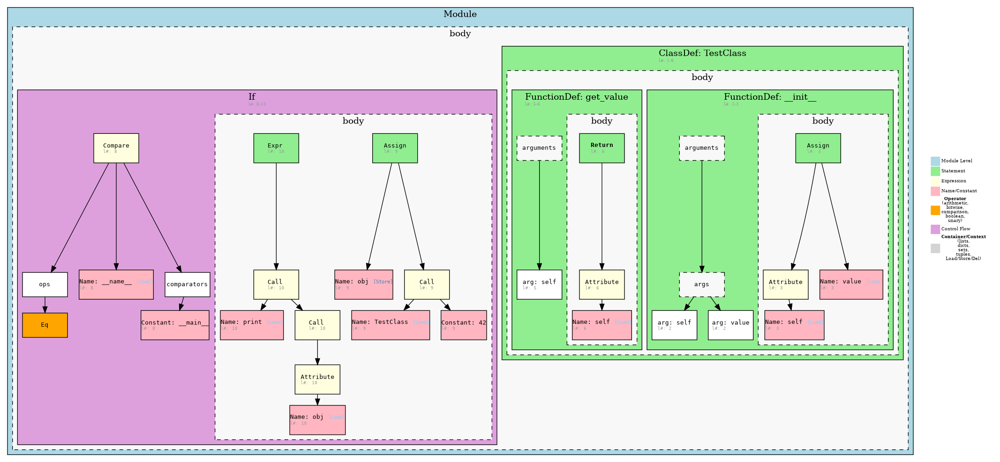
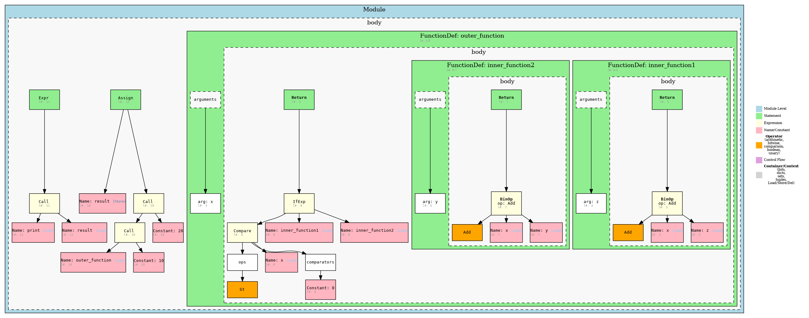
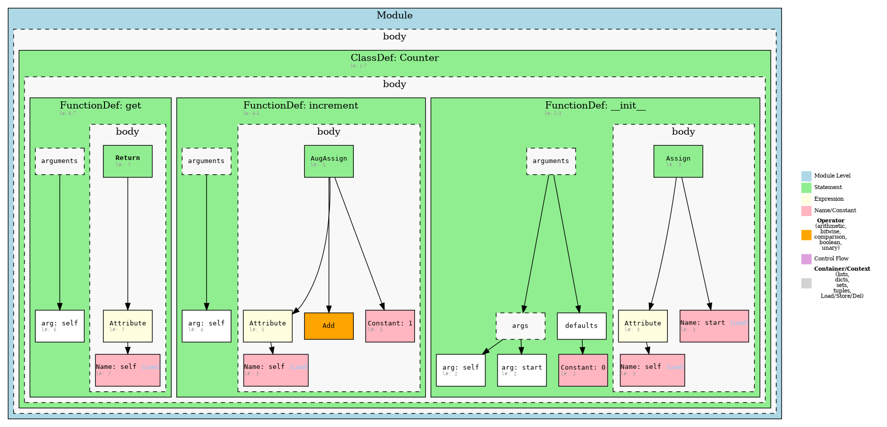

# Python AST Visualizer

A tool to visualize Python's Abstract Syntax Tree (AST) using Graphviz.

## Features

- **Comprehensive AST Visualization**: Generates detailed diagrams of Python's Abstract Syntax Tree.
- **Graphviz Powered**: Utilizes Graphviz for robust and customizable graph rendering.
- **Interactive Web Interface**:
    - Select Python files from a list.
    - View ASTs as SVG in the browser.
    - Pan and zoom the SVG for detailed inspection.
    - Reset view to default.
- **Command-Line Interface (CLI)**: Generate static AST visualizations as SVG or PNG files.
- **Color-Coded Nodes**: Differentiates between module-level constructs, statements, expressions, names, constants, operators, and control flow for clarity.
- **Customizable Appearance**: Node colors and legend details are configurable.

## Python AST Structure

<details>
<summary>Detailed Python AST Grammar Specification</summary>

The AST follows Python's abstract grammar, which defines the following main components:

```text
module Python
{
    mod = Module(stmt* body, type_ignore* type_ignores)
        | Interactive(stmt* body)
        | Expression(expr body)
        | FunctionType(expr* argtypes, expr returns)

    stmt = FunctionDef(identifier name, arguments args,
                       stmt* body, expr* decorator_list, expr? returns,
                       string? type_comment, type_param* type_params)
          | AsyncFunctionDef(identifier name, arguments args,
                             stmt* body, expr* decorator_list, expr? returns,
                             string? type_comment, type_param* type_params)
          | ClassDef(identifier name,
             expr* bases,
             keyword* keywords,
             stmt* body,
             expr* decorator_list,
             type_param* type_params)
          | Return(expr? value)
          | Delete(expr* targets)
          | Assign(expr* targets, expr value, string? type_comment)
          | TypeAlias(expr name, type_param* type_params, expr value)
          | AugAssign(expr target, operator op, expr value)
          | AnnAssign(expr target, expr annotation, expr? value, int simple)
          | For(expr target, expr iter, stmt* body, stmt* orelse, string? type_comment)
          | AsyncFor(expr target, expr iter, stmt* body, stmt* orelse, string? type_comment)
          | While(expr test, stmt* body, stmt* orelse)
          | If(expr test, stmt* body, stmt* orelse)
          | With(withitem* items, stmt* body, string? type_comment)
          | AsyncWith(withitem* items, stmt* body, string? type_comment)
          | Match(expr subject, match_case* cases)
          | Raise(expr? exc, expr? cause)
          | Try(stmt* body, excepthandler* handlers, stmt* orelse, stmt* finalbody)
          | TryStar(stmt* body, excepthandler* handlers, stmt* orelse, stmt* finalbody)
          | Assert(expr test, expr? msg)
          | Import(alias* names)
          | ImportFrom(identifier? module, alias* names, int? level)
          | Global(identifier* names)
          | Nonlocal(identifier* names)
          | Expr(expr value)
          | Pass | Break | Continue
          attributes (int lineno, int col_offset, int? end_lineno, int? end_col_offset)

    expr = BoolOp(boolop op, expr* values)
         | NamedExpr(expr target, expr value)
         | BinOp(expr left, operator op, expr right)
         | UnaryOp(unaryop op, expr operand)
         | Lambda(arguments args, expr body)
         | IfExp(expr test, expr body, expr orelse)
         | Dict(expr* keys, expr* values)
         | Set(expr* elts)
         | ListComp(expr elt, comprehension* generators)
         | SetComp(expr elt, comprehension* generators)
         | DictComp(expr key, expr value, comprehension* generators)
         | GeneratorExp(expr elt, comprehension* generators)
         | Await(expr value)
         | Yield(expr? value)
         | YieldFrom(expr value)
         | Compare(expr left, cmpop* ops, expr* comparators)
         | Call(expr func, expr* args, keyword* keywords)
         | FormattedValue(expr value, int conversion, expr? format_spec)
         | JoinedStr(expr* values)
         | Constant(constant value, string? kind)
         | Attribute(expr value, identifier attr, expr_context ctx)
         | Subscript(expr value, expr slice, expr_context ctx)
         | Starred(expr value, expr_context ctx)
         | Name(identifier id, expr_context ctx)
         | List(expr* elts, expr_context ctx)
         | Tuple(expr* elts, expr_context ctx)
         | Slice(expr? lower, expr? upper, expr? step)
         attributes (int lineno, int col_offset, int? end_lineno, int? end_col_offset)

    expr_context = Load | Store | Del
    boolop = And | Or
    operator = Add | Sub | Mult | MatMult | Div | Mod | Pow | LShift | RShift | BitOr | BitXor | BitAnd | FloorDiv
    unaryop = Invert | Not | UAdd | USub
    cmpop = Eq | NotEq | Lt | LtE | Gt | GtE | Is | IsNot | In | NotIn
    comprehension = (expr target, expr iter, expr* ifs, int is_async)
    excepthandler = ExceptHandler(expr? type, identifier? name, stmt* body)
                    attributes (int lineno, int col_offset, int? end_lineno, int? end_col_offset)
    arguments = (arg* posonlyargs, arg* args, arg? vararg, arg* kwonlyargs,
                 expr* kw_defaults, arg? kwarg, expr* defaults)
    arg = (identifier arg, expr? annotation, string? type_comment)
           attributes (int lineno, int col_offset, int? end_lineno, int? end_col_offset)
    keyword = (identifier? arg, expr value)
               attributes (int lineno, int col_offset, int? end_lineno, int? end_col_offset)
    alias = (identifier name, identifier? asname)
             attributes (int lineno, int col_offset, int? end_lineno, int? end_col_offset)
    withitem = (expr context_expr, expr? optional_vars)
    match_case = (pattern pattern, expr? guard, stmt* body)
    pattern = MatchValue(expr value)
            | MatchSingleton(constant value)
            | MatchSequence(pattern* patterns)
            | MatchMapping(expr* keys, pattern* patterns, identifier? rest)
            | MatchClass(expr cls, pattern* patterns, identifier* kwd_attrs, pattern* kwd_patterns)
            | MatchStar(identifier? name)
            | MatchAs(pattern? pattern, identifier? name)
            | MatchOr(pattern* patterns)
             attributes (int lineno, int col_offset, int end_lineno, int end_col_offset)
    type_ignore = TypeIgnore(int lineno, string tag)
    type_param = TypeVar(identifier name, expr? bound, expr? default_value)
               | ParamSpec(identifier name, expr? default_value)
               | TypeVarTuple(identifier name, expr? default_value)
               attributes (int lineno, int col_offset, int end_lineno, int end_col_offset)
}
```
</details>

## Node Colors

The visualization uses the following color scheme:

- **Module Level** (`lightblue`)
- **Statements** (`lightgreen`)
- **Expressions** (`lightyellow`)
- **Names and Constants** (`lightpink`)
- **Operators** (`orange`)
- **Control Flow** (`plum`)
- **Containers** (`lightgrey`)

## Technical Implementation Details

This project combines a Python backend (using FastAPI) to parse code and generate DOT descriptions, and a JavaScript frontend (using Vite, @hpcc-js/wasm, and svg-pan-zoom) to display and interact with the AST visualizations.

### Overall Architecture

A simplified data flow for the web interface:

```
Browser (index.html, main.js)
  |
  |--- (HTTP GET /api/list-python-files on load) --> Backend API (FastAPI @ :8000)
  |                                                     |
  |<-- (JSON list of example Python files) -------------|
  |
  |--- (User selects a file)
  |
  |--- (HTTP GET /api/dot/{filename}) ---------------> Backend API (FastAPI @ :8000)
  |                                                     |
  |                                                     |--- Uses ast_parser.py to parse selected Python code
  |                                                     |--- Uses dot_render.py to generate Graphviz DOT string
  |                                                     |
  |<-- (Graphviz DOT string as plain text) -------------|
  |
  |--- frontend/main.js uses @hpcc-js/wasm to convert DOT string to SVG
  |--- SVG is injected into the #graph div
  |--- frontend/main.js uses svg-pan-zoom for pan/zoom/reset functionality
```

### Backend (`codeviz/backend/`)

The backend is a FastAPI application responsible for parsing Python files and generating their AST in DOT format.

- **`backend/main.py`**:
  Sets up the FastAPI application, defines CORS middleware, and includes API route handlers.
  ```python
  # Simplified snippet from backend/main.py
  from fastapi import FastAPI
  # ... other imports ...

  app = FastAPI()

  # CORS (Cross-Origin Resource Sharing)
  app.add_middleware(
      CORSMiddleware,
      allow_origins=["*"], # Allows all origins, adjust for production
      # ... other CORS settings ...
  )

  # API endpoints are defined here or included from api.py
  # (In the current structure, they are directly in main.py)
  ```

- **API Endpoints (defined in `backend/main.py` currently)**:
    - `GET /api/list-python-files`: Lists available Python files from the `python_examples` directory.
      ```python
      # Simplified snippet from backend/main.py
      @app.get("/api/list-python-files")
      def list_python_files():
          files = [f for f in os.listdir(PYTHON_EXAMPLES_DIR) if f.endswith('.py')]
          return JSONResponse(files)
      ```
    - `GET /api/dot/{filename}`: Takes a Python filename, reads the file, parses it using `ast_parser.py`, generates a DOT string using `dot_render.py`, and returns it.
      ```python
      # Simplified snippet from backend/main.py
      @app.get("/api/dot/{filename}")
      def get_dot(filename: str):
          # ... (file validation and reading) ...
          with open(file_path, 'r') as f:
              code = f.read()
          ast_dict = parse_code(code) # From ast_parser.py
          dot_output = generate_dot(ast_dict) # From dot_render.py
          return PlainTextResponse(str(dot_output))
      ```

### Frontend (`codeviz/frontend/`)

The frontend is a modern JavaScript application built with Vite.

- **`frontend/index.html`**:
  The main entry point for the web application. It sets up a `div` with `id="graph"` where the SVG will be rendered and includes `main.js`.
  ```html
  <!DOCTYPE html>
  <html lang="en">
    <head>
      <meta charset="UTF-8" />
      <title>AST DOT Viewer</title>
      <script type="module" src="/main.js"></script>
      <style>
        body { margin: 0; }
        #graph { width: 100vw; height: 100vh; }
        /* Basic styling for select and reset button can be added here or in JS */
      </style>
    </head>
    <body>
      <!-- File picker select and reset button are added dynamically by main.js -->
      <div id="graph"></div>
    </body>
  </html>
  ```

- **`frontend/main.js`**:
  Handles all client-side logic:
    - **Fetching data**: Retrieves the list of Python files and the DOT string for a selected file from the backend API.
    - **SVG Rendering**: Uses `@hpcc-js/wasm` (a WebAssembly port of Graphviz) to convert the DOT string into an SVG image directly in the browser.
      ```javascript
      // Simplified snippet from frontend/main.js
      import { Graphviz } from "@hpcc-js/wasm";
      // ...

      async function loadAndRenderDot(pyFile) {
        const response = await fetch(`http://localhost:8000/api/dot/${pyFile}`);
        const dot = await response.text();
        const graphDiv = document.getElementById('graph');
        graphDiv.innerHTML = ''; // Clear previous graph

        const graphviz = await Graphviz.load();
        const svg = await graphviz.layout(dot, "svg", "dot");
        graphDiv.innerHTML = svg;
        const svgElem = graphDiv.querySelector("svg");

        if (svgElem) {
          svgElem.setAttribute('width', '100%');
          svgElem.setAttribute('height', '100%');
        }
        // ... initialize svg-pan-zoom ...
      }
      ```
    - **Interactivity**: Uses the `svg-pan-zoom` library to enable panning and zooming of the rendered SVG. Also implements the "Reset View" functionality.
      ```javascript
      // Simplified snippet from frontend/main.js
      import svgPanZoom from "svg-pan-zoom";
      let panZoomInstance;

      // ... inside loadAndRenderDot, after SVG is in DOM ...
      if (panZoomInstance) {
        panZoomInstance.destroy();
      }
      panZoomInstance = svgPanZoom(svgElem, {
        maxZoom: 5,
        minZoom: 0.5,
        contain: false, // Allows free dragging
        center: true    // Center the initial view
      });

      // Reset button logic
      // ...
      // resetButton.addEventListener('click', () => {
      //   if (panZoomInstance) {
      //     panZoomInstance.reset();
      //     panZoomInstance.center();
      //   }
      // });
      ```

### Core AST Processing Logic

These Python modules form the heart of the AST generation:

- **`ast_parser.py`**:
    - **Input**: Python source code (string).
    - **Process**:
        1.  Uses Python's built-in `ast.parse(source_code)` to convert the raw source code into Python's native Abstract Syntax Tree structure. This tree is composed of objects like `ast.Module`, `ast.FunctionDef`, `ast.Call`, etc., as defined in the `ast` module documentation.
        2.  Traverses this native AST. For each node, it extracts key information such as:
            - The type of the AST node (e.g., 'FunctionDef', 'Assign', 'Name').
            - Relevant attributes (e.g., function name, variable names, constant values, operator types).
            - Line and column offset numbers.
            - Child nodes.
        3.  Transforms this information into a custom, often simplified, dictionary-based representation of the AST. This intermediate structure is designed to be easily consumable by the `dot_render.py` module and typically includes fields like `'type'`, `'name'` (if applicable), `'lineno'`, and `'children'` (a list of child node dictionaries).
    - **Output**: A nested dictionary or a list of dictionaries representing the parsed AST, tailored for visualization purposes.
    - **Note**: This module focuses purely on parsing and structuring the AST data; it does not deal with DOT generation or colors directly.

- **`dot_render.py`**:
    - **Input**: The custom AST dictionary structure produced by `ast_parser.py`, and configuration data (like `NODE_COLORS` and `LEGEND_DATA`) from `viz_config.py`.
    - **Process**:
        1.  Initializes a Graphviz graph object (e.g., `digraph AST { ... }`) with global graph attributes like layout direction (`rankdir`).
        2.  Recursively (or iteratively) traverses the input AST dictionary.
        3.  For each node dictionary, it generates Graphviz DOT language statements:
            - **Node Definition**: Creates a unique node ID (e.g., based on object ID or a counter). Defines the node with attributes: 
                - `label`: Constructed from the node's type and relevant attributes (e.g., `"FunctionDef: my_func\n(line 10)"`).
                - `shape`: Typically 'box' or similar.
                - `style`: 'filled'.
                - `fillcolor`: Determined by looking up the node's `'type'` in the `NODE_COLORS` dictionary (from `viz_config.py`). A default color is used if the type is not found.
                Example DOT: `node_123 [label="FunctionDef: foo\n(line 5)", shape=box, style=filled, fillcolor=lightgreen];`
            - **Edge Definition**: If the current node has a parent in the traversal, an edge is created from the parent's ID to the current node's ID.
                Example DOT: `parent_node_id -> node_123;`
        4.  **Legend Generation**: Constructs a separate Graphviz subgraph for the legend. It iterates through `LEGEND_DATA` (from `viz_config.py`), creating a colored box and label for each legend item, mimicking the style of the main graph nodes.
    - **Output**: A single string containing the complete AST visualization in Graphviz DOT language.
    - **Example DOT Snippet (Conceptual)**:
      ```dot
      digraph AST {
          rankdir=TB;
          node [shape=box, style=filled];

          // Legend Subgraph
          subgraph cluster_legend {
              label="Legend";
              bgcolor="lightgray";
              legend_node_type_1 [label="Module Level", fillcolor=lightblue];
              // ... other legend items ...
          }

          // AST Nodes and Edges
          module_root [label="Module\n(line 1)", fillcolor=lightblue];
          func_def_1 [label="FunctionDef: my_func\n(line 2)", fillcolor=lightgreen];
          module_root -> func_def_1;
          // ... more nodes and edges ...
      }
      ```

- **`viz_config.py`**:
    - Centralizes configuration for the visualization, such as:
        - `NODE_COLORS`: A dictionary mapping AST node type strings (e.g., `'FunctionDef'`, `'Call'`) to color names (e.g., `'lightgreen'`, `'lightyellow'`). This is crucial for `dot_render.py`.
        - `LEGEND_DATA`: A list or dictionary defining the categories, representative node types, and corresponding labels to be shown in the graph's legend. Used by `dot_render.py` to build the legend subgraph.

### Color Mapping

The color scheme for AST node types is defined in the `NODE_COLORS` dictionary in `ast_parser.py`. This dictionary maps each AST node type (as a string) to a color name. For example:

```python
NODE_COLORS = {
    # Module Level
    'Module': 'lightblue',
    # Statements
    'FunctionDef': 'lightgreen',
    # ...
    # Operators (arithmetic, bitwise, comparison, boolean, unary)
    'Add': 'orange', 'Sub': 'orange', 'Eq': 'orange', 'And': 'orange', 'Not': 'orange',
    # Contexts
    'Load': 'lightgrey', 'Store': 'lightgrey', 'Del': 'lightgrey',
    # ...
}
```

All operator types (arithmetic, bitwise, comparison, boolean, unary) are colored orange. Context nodes (`Load`, `Store`, `Del`) are colored light grey, the same as containers.

### Legend Generation

The legend in the output graph is generated from a list of representative node types and their categories:

```python
LEGEND = [
    ("Module Level", 'Module'),
    ("Statement", 'FunctionDef'),
    ("Expression", 'BinOp'),
    ("Name/Constant", 'Name'),
    ("Operator (arithmetic, bitwise, comparison, boolean, unary)", 'Add'),
    ("Control Flow", 'If'),
    ("Container/Context (lists, dicts, sets, tuples, Load/Store/Del)", 'List'),
]
```

In the `generate_dot` function, the legend is rendered as a subgraph with colored boxes and labels, matching the color map. The legend is positioned at the top right of the output graph.

### AST Parsing and Visualization

- The input Python code is parsed using the `ast` module to produce an AST.
- The AST is recursively converted to a dictionary structure, preserving important fields (such as `name`, `id`, `arg`, and line numbers).
- The `generate_dot` function traverses this dictionary, creating a Graphviz node for each AST node. The node's color is determined by its type using `NODE_COLORS`.
- Labels are formatted with the node type, relevant fields, and line numbers (in small font).
- Container nodes (like `body`, `args`, etc.) are shown as dashed boxes only when they have multiple children. Single-child containers are skipped for clarity.
- Context nodes (`Load`, `Store`, `Del`) are rendered as light grey, the same as containers, to indicate their auxiliary role in the AST.
- All operator types (arithmetic, bitwise, comparison, boolean, unary, and comparison) are rendered in orange for easy identification.

**Note:** The AST traversal in `generate_dot` is recursive. For extremely deep or adversarially nested ASTs, this could hit Python's recursion limit (typically 1000). For most real-world code, this is not an issue. If you need to handle very deep trees, consider adding a `max_depth` safeguard or rewriting the traversal to use an explicit stack (iterative approach).

### Example: Rendering a Node

For example, a comparison operation like `x < 0` will be rendered as:
- A `Compare` node (light yellow, as an expression)
- With child nodes for the left operand (`Name: x`), the operator (`Lt`, orange), and the right operand (`Constant: 0`)

```python
# Example snippet from generate_dot:
color = NODE_COLORS.get(node['type'], 'white')
dot.node(node_id, label=label, style=style, fillcolor=color, shape='box')
```

This approach ensures that every node type defined in the Python AST grammar is colored and labeled according to its role, making the visualization both accurate and easy to interpret.

## Usage

### CLI Usage

```bash
python cli.py your_file.py -o output
```

This will generate an SVG or PNG file named `output.svg` or `output.png` containing the AST visualization.

For example:
```bash
python cli.py python_examples/test_0.py -o ast_0
```

### Web Interface Usage

The web interface provides an interactive way to view ASTs.

**1. Prerequisites:**
   - Python 3.x
   - Node.js and npm (for the frontend)
   - Graphviz (ensure `dot` command is in your system PATH if not using the WASM version exclusively for all rendering)

**2. Installation:**

   - **Backend (Python):**
     Navigate to the project root (`codeviz/`) and install Python dependencies:
     ```bash
     pip install -r requirements.txt
     ```
     (Ensure `requirements.txt` includes `fastapi`, `uvicorn`, etc.)

   - **Frontend (JavaScript):**
     Navigate to the `frontend` directory (`codeviz/frontend/`):
     ```bash
     cd frontend
     npm install
     ```

**3. Running the Application:**

   - **Start the Backend Server:**
     From the project root (`codeviz/`), run:
     ```bash
     uvicorn backend.main:app --reload --port 8000
     ```
     The backend server will typically run on `http://localhost:8000`.

   - **Start the Frontend Development Server:**
     In a new terminal, navigate to the `frontend` directory (`codeviz/frontend/`) and run:
     ```bash
     npm run dev
     ```
     This will usually open the application in your browser, often at an address like `http://localhost:5173` (Vite's default). The frontend will make API calls to the backend at `http://localhost:8000`.

**4. Accessing the Visualizer:**
   Open your web browser and navigate to the address provided by the frontend development server (e.g., `http://localhost:5173`). You should see a dropdown to select Python files from the `python_examples` directory.

## Project Structure

- `cli.py` — Command-line entry point for generating static AST visualizations.
- `ast_parser.py` — Core logic for parsing Python code into an AST.
- `ast_handlers.py` — Contains handlers or specific logic for processing different AST node types (if applicable, or adjust description).
- `dot_render.py` — Handles the conversion of the AST into Graphviz DOT language and legend generation.
- `viz_config.py` — Configuration for node colors, legend, and other visual aspects.
- `backend/` — Directory containing the backend server.
  - `main.py` — FastAPI application setup and main server logic.
  - `api.py` — Defines API endpoints, e.g., for listing files and generating DOT strings.
- `frontend/` — Directory containing the web interface.
  - `index.html` — The main HTML page for the AST visualizer web UI.
  - `main.js` — JavaScript logic for the frontend, including fetching data, rendering SVGs with @hpcc-js/wasm, and enabling pan/zoom functionality.
- `python_examples/` — Contains example Python scripts that can be visualized.
- `requirements.txt` — Lists Python dependencies for the project (e.g., FastAPI, Uvicorn).
- `ROADMAP.md` — Document outlining future plans and potential features for the project.
- `tests/` — Directory for test files and potentially test scripts.

## Example

For the following Python code:
```python
def greet(name):
    message = "Hello " + name
    return message
```

The visualization will show:
- Function definition node (lightgreen)
- Name nodes (lightpink)
- String constant (lightpink)
- Binary operation (lightyellow)
- Return statement (lightgreen)

## Test Files and Outputs

Below are the test files used for visualization and their corresponding output files:

### test_1.py
```python
class TestClass:
    def __init__(self, value):
        self.value = value

    def get_value(self):
        return self.value

if __name__ == "__main__":
    obj = TestClass(42)
    print(obj.get_value())
    
```
**Output:** `python_examples/test_1.png`


### inner_fun.py
```python

def outer_function(x):
    def inner_function1(z):
        return x + z
    def inner_function2(y):
        return x + y
    return inner_function1 if x > 0 else inner_function2

result = outer_function(10)(20)
print(result)
    
```
**Output:** `python_examples/inner.png`


### class_with_methods.py
```python
class Counter:
    def __init__(self, start=0):
        self.value = start
    def increment(self):
        self.value += 1
    def get(self):
        return self.value 
```
**Output:** `class_with_methods.png`


## Future Enhancements / TODO

This section outlines potential future improvements and features, largely inspired by the project's roadmap. Contributions are welcome!
### Possible bugs
- If(expr test, stmt* body, stmt* orelse): is Control Flow but IfExp(expr test, expr body, expr orelse) is Expression ??? What is control flow exactly in the ast?
- Everything should be inside the body box?
### Core Functionality & Visualization
- **Node Tooltips**: Implement tooltips in the web viewer to show more detailed information about an AST node on hover.
- **Edge Labels**: Add labels to edges in the graph to clarify the relationships between nodes (e.g., 'child', 'operand', 'body').
- **Advanced Styling**: Offer more granular control over node and graph styling.

### Language Support
- **JavaScript Support**: Integrate a JavaScript parser (e.g., Babel, Acorn, Esprima) to visualize JavaScript code ASTs.
- **Other Languages**: Explore support for other languages (e.g., C/C++ via Clang AST, Java).

### Performance
- **AST Node Filtering**: Allow users to filter the AST display, for example, by hiding certain node types or limiting the depth of the tree displayed.
- **Level-Based Rendering / Lazy Loading**: For very large graphs, implement techniques to only render visible parts or load branches on demand.
- **DOT Simplification**: Investigate and implement DOT output simplification for large graphs to improve rendering performance.

### CLI Enhancements
- **Batch Processing**: Allow the CLI to process multiple files or entire directories at once.
- **Enhanced Format Conversion**: Ensure robust conversion to various output formats (SVG, PNG, DOT, potentially PDF).

### Web Interface Enhancements
- **Interactive Node Editing**: (Stretch Goal) Allow users to make simple modifications to the AST via the web interface and see the DOT/code update.
- **Code -> Graph Sync**: Highlight corresponding code when a graph node is clicked, and vice-versa (if a code panel is added).
- **Configuration UI**: Allow users to change visualization settings (colors, layout) directly in the web UI.

### Packaging & Distribution
- **PyPI Package**: Package the Python backend and CLI tool for easy installation via `pip`.
- **NPM Package**: Package the frontend components for easier integration into other web projects.
- **Docker Image**: Provide a Docker image for a self-contained, easy-to-run environment.

### IDE Integration
- **VSCode Extension**: Develop a Visual Studio Code extension to view ASTs directly within the editor.
- **Other IDEs**: Explore integration possibilities with other popular IDEs.

### Documentation & Testing
- **Comprehensive User Guide**: Detailed guide on using all features of the CLI and web interface.
- **API Reference**: Document the Python API for programmatic use.
- **Increased Test Coverage**: Expand unit and integration tests for all modules. 